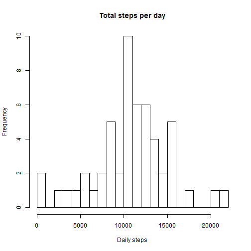

## Loading and preprocessing the data
Unzip and read activity data. 

```r
# unzip and read data
# downloaded from https://d396qusza40orc.cloudfront.net/repdata%2Fdata%2Factivity.zip, 10.55AM, 2015-5-8
unzip("./activity.zip") 
activityData <- read.csv("./activity.csv")
```

## What is mean total number of steps taken per day?
Histogram with the total number of steps taken each day. For this part of the assignment, ignoring missing values.

```r
hist(tapply(activityData$steps, activityData$date, sum), xlab = "Daily steps", 
  	breaks = 20, 
		main = "Total steps per day")
```

 

Calculate the total number of steps taken per day.

```r
dailySteps <- as.numeric(tapply(activityData$steps, activityData$date, sum))
```
Calculate the mean and median of the total number of steps taken per day.

```r
dailyStepsMean <- mean(dailySteps, na.rm = TRUE)
dailyStepsMedian <- median(dailySteps, na.rm = TRUE)
```
The mean of total number of steps taken per day is 10766.19 and the median of total number of steps taken per day is 10765.

```r
dailyStepsMean
```

```
## [1] 10766.19
```

```r
dailyStepsMedian
```

```
## [1] 10765
```
## What is the average daily activity pattern?
Make a time series plot (i.e. type = "l") of the 5-minute interval (x-axis) and the average number of steps taken, averaged across all days (y-axis).

```r
activityData$interval <- as.factor(as.character(activityData$interval))
intervalMean <- as.numeric(tapply(activityData$steps, activityData$interval, mean, na.rm = TRUE))
intervals <- data.frame(intervals = as.numeric(levels(activityData$interval)), intervalMean)
intervals <- intervals[order(intervals$intervals), ]

labels <- c("00:00", "05:00", "10:00", "15:00", "20:00")
labelsSeq <- seq(0, 2000, 500)
plot(intervals$intervals, intervals$intervalMean, type = "l", main = "Average steps per 5-minute intervals", 
  	ylab = "Average steps", xlab = "Time of day", xaxt = "n")
axis(side = 1, at = labelsSeq, labels = labels)
```

 

Sort intervals to find Which 5-minute interval, on average across all the days in the dataset, contains the maximum number of steps.

```r
sortedIntervals <- intervals[order(intervals$intervalMean, decreasing = TRUE), ]
head(sortedIntervals)
```

```
##     intervals intervalMean
## 272       835     206.1698
## 273       840     195.9245
## 275       850     183.3962
## 274       845     179.5660
## 271       830     177.3019
## 269       820     171.1509
```

```r
maxStepsInterval <- sortedIntervals$intervals[1[1]]
```
The 5-minute interval, on average across all the days in the dataset, containing the maximum number of steps is between 8:35 and 8:40.

```r
maxStepsInterval
```

```
## [1] 835
```

## Imputing missing values
There are a number of days/intervals where there are missing values (coded as NA). The presence of missing days may introduce bias into some calculations or summaries of the data. The total number of missing values in the dataset (i.e. the total number of rows with NAs) is 2304. 

```r
dim(activityData[is.na(activityData$steps), ])[1]
```

```
## [1] 2304
```
Fill in all of the missing values in the dataset by changing NA to the mean value for the particular 5-minute interval.

```r
stepsReplaced <- vector()
for (i in 1:dim(activityData)[1]) {
  if (is.na(activityData$steps[i])) {
  	stepsReplaced <- c(stepsReplaced, intervals$intervalMean[intervals$intervals == activityData$interval[i]])
	} else {
		stepsReplaced <- c(stepsReplaced, activityData$steps[i])
	}
}
```
New dataset after imputation.

```r
activityDataWithoutNa <- data.frame(stepsReplaced = stepsReplaced, date = activityData$date, 
		interval = activityData$interval)
```
Histogram of the total number of steps taken each day.

```r
hist(tapply(activityDataWithoutNa$steps, activityDataWithoutNa$date, 
				sum), xlab = "Daily steps", breaks = 20, main = "Total steps taken day")
```

 

Calculate the mean and median total number of steps taken per day

```r
dailySteps <- as.numeric(tapply(activityDataWithoutNa$steps, 
				activityDataWithoutNa$date, sum))
dailyStepsMean <- mean(dailySteps)
dailyStepsMedian <- median(dailySteps)
```
After imputation, the mean of total number of steps taken per day is 10766 and the median of total number of steps taken per day is 10766 (the mean is the same as the median), which was not the case previously. However, because the strategy used to fill in missing values was by imputing the mean value for the particular 5-minute interval, the impact is negligeable. 

```r
dailyStepsMean
```

```
## [1] 10766.19
```

```r
dailyStepsMedian
```

```
## [1] 10766.19
```
## Are there differences in activity patterns between weekdays and weekends?
Create a new factor variable with two factor levels in the dataset (weekday, weekend), indicating whether a given date is a weekday or weekend day, and make the corresponding average calculations.

```r
activityDataWithoutNa$typeOfDay <- c("weekend", "weekday", "weekday", 
  	"weekday", "weekday", "weekday", "weekend")[as.POSIXlt(activityDataWithoutNa$date)$wday + 1]
activityDataWithoutNa$typeOfDay <- as.factor(activityDataWithoutNa$typeOfDay)
isWeekday <- activityDataWithoutNa[activityDataWithoutNa$typeOfDay == "weekday", ]
isWeekend <- activityDataWithoutNa[activityDataWithoutNa$typeOfDay == "weekend", ]
isWeekdayMeans <- as.numeric(tapply(isWeekday$steps, isWeekday$interval, mean))
isWeekendMeans <- as.numeric(tapply(isWeekend$steps, isWeekend$interval, mean))
intervalsTypeOfDay <- data.frame(intervals = as.numeric(levels(activityData$interval)), 
  	isWeekdayMeans, isWeekendMeans)
intervalsTypeOfDay <- intervalsTypeOfDay[order(intervalsTypeOfDay$intervals), ]
```

Plots containing a time series plot of the 5-minute interval (x-axis) and the average number of steps taken, averaged across all weekday days or weekend days (y-axis). One plot for dates that fall in weekdays, and nother for dates that fall in weekends.

```r
par <- par(mfrow = c(2, 1))
plot(intervalsTypeOfDay$intervals, intervalsTypeOfDay$isWeekdayMeans, type = "l", 
  	col = "red", ylab = "Average steps", xlab = "Time of day", main = "Average steps per 5-minute intervals at weekday", 
		xaxt = "n")
axis(side = 1, at = labelsSeq, labels = labels)
plot(intervalsTypeOfDay$intervals, intervalsTypeOfDay$isWeekendMeans, type = "l", 
		col = "blue", ylab = "Average steps", xlab = "Time of day", main = "Average steps per 5-minute intervals at weekend", 
		xaxt = "n")
axis(side = 1, at = labelsSeq, labels = labels)
```

 

Finally, combine the two plots to compare weekdays and weekends. There are differences between weekdays and weekend days. There are two main peaks in activity that seem to relate to going to work, and coming back home after work. There are more peaks in activity during the weekend, possibly related to the fact that activity is not driven by the work routine; during the weekend, activity also seem to ramp up and ramp down later in the day when compared to weekdays.  

```r
plot(intervalsTypeOfDay$intervals, intervalsTypeOfDay$isWeekdayMeans, type = "l", 
  	col = "red", ylab = "Average steps", xlab = "Time of day", main = "Weekdays vs weekends", 
		xaxt = "n")
axis(side = 1, at = labelsSeq, labels = labels)
lines(intervalsTypeOfDay$intervals, intervalsTypeOfDay$isWeekendMeans, type = "l", col = "blue")
legend(1500, 230, c("Weekend", "Weekday "), lty = c(1, 1), lwd = c(1, 1), col = c("blue", "red"))
```

 

